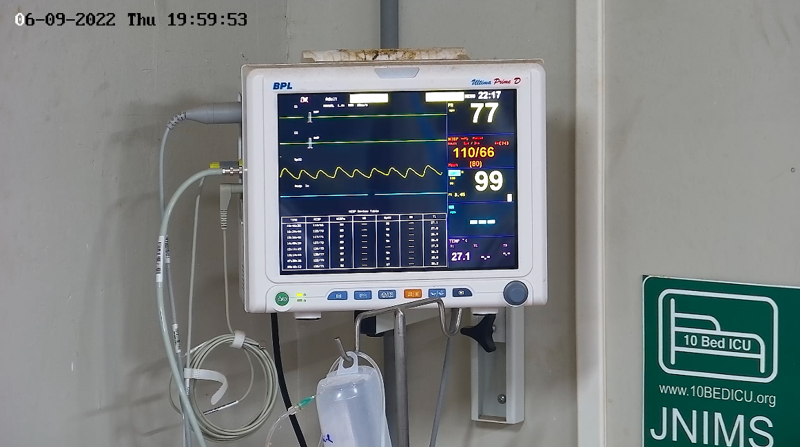
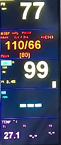

# The Problem
Currently all the patients Electronic Health Record(EHR) are manually written and hence are prone to errors. This manual workflow also gives nurses trouble of making an extra round for recording the data.

# The Solution(We are trying to achieve)
With the help of camera installed on smart ICU we can capture the image of 5 Para Monitor at predefined intervals and extract data from this image, making whole process fully automatic and this data gets updated in care module as a part of patient's EHR.

### Current Blockers
- Cropping the image so that we can get rid of unecessary noises. Below shows the example:

Original Image:

Cropped Image:

- Detecting whether monitor os off or on.
- Extracting data with correct category.
- ...

# Code to start with
### Script-1

- **care.ipynb** gives visualization how image is cropped.

### Script-2

- **care_script.ipynb** uses time displayed on monitor to crop the image and then keras-ocr to extract the data. 

